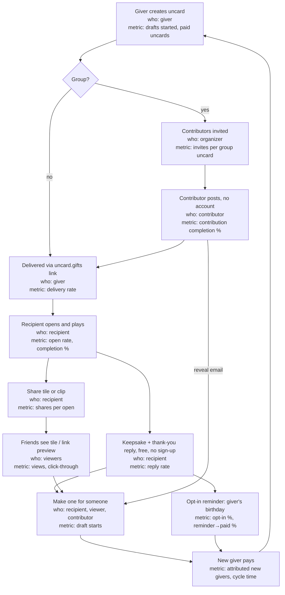

# Sharing and Referral Loop Research

**Status:** Draft
**Updated:** 2026-10-06
**Owner:** Jordan
**Method:** Written by Jordan's research agent and posted by Jordan in Slack #non-build-stuff on 2026-10-02. Ingested as written; the findings were not re-verified here.

## TL;DR

- **Growth should come from the gift itself, not paid referrals.** Build three free, attributed loops first, in priority order: contributors to a group uncard becoming organizers, recipients making one for someone else right after the reveal, and tasteful share tiles/link previews that spread curiosity without exposing private words.
- **Pay only a small, in-kind credit, and only for giver-to-giver referrals tied to a paid, delivered uncard** — $2 off the referee, one free uncard credit to the referrer after the referee's uncard is delivered and opened. Cash and bigger rewards don't reliably help and invite fraud. The recipient should never see an incentive, a paywall or a sign-up wall.
- **Share tiles and link previews have hard limits:** never the giver's or contributors' words (unless the giver allowed quoting and the recipient picked the line), never the recipient's full name/photos/age, never a price or discount code, never the private uncard URL.
- **Starting targets:** k (viral coefficient) ≥ 0.20 at 90 days, ≥ 0.35 by summer 2027; contributor → organizer rate 5–10% within 60 days; shares per open 0.10–0.25; median cycle time under 21 days for the contributor loop.
- **Proposes a fairly detailed attribution and analytics schema** — a `sharer_id` on every link, and events like `draft_started`, `uncard_paid`, `uncard_opened`/`uncard_completed`, `share_view`/`share_click`, keyed by `uncard_id`.

## Implication for Uncard

- **Agrees with the just-ingested SEO plan on attribution.** This doc's "sharer-ID on every link" recommendation lines up with `strategy/domain-tracking-seo.md`'s decision #6 (every card ends with a tagged "Make one" link). Two independently-written 2026-10-02 documents converging on end-card-link attribution is a useful signal.
- **The link design matches `decisions/0006`.** The private `uncard.gifts/<token>` link plus a separate "share version" (`uncard.gifts/s/<share_id>`) that never carries the full uncard matches 0006's gift-Worker design and its "recipients never tracked" framing in spirit.
- **But the proposed analytics schema goes further than "no analytics."** Events like `uncard_opened`, `uncard_completed` (with device class and time-to-open) tied to `uncard_id`/`sharer_id` are recipient-side tracking on the gift itself. `AGENTS.md`'s privacy gate and `decisions/0006` both say the gift Worker carries "no analytics" and recipients are never tracked (D12). This is the same tension flagged in `research/recipient-attention.md` — worth resolving in one place rather than three.
- **Referral discounting is payments-adjacent.** The "$2 off" / free-credit mechanics assume a live discount and payment system. `AGENTS.md`: "Stripe is deferred. Do not scaffold, connect or mock payments." Useful as a future spec, not a build ticket.
- **Pricing math uses both $4.99 and $5.99** as reference points, consistent with `decisions/0002`'s $5.99 (and its superseded $4.99), and with the two-a-month plan's roughly-$5.00-per-uncard economics.

## Source document

> The text below is the research file as posted in Slack on 2026-10-02 (`uncard Sharing and Referral Loop Design, Incentives and Measurement (October 2026).md`), reproduced verbatim except for heading levels, which are shifted down so this page has a single top-level heading. Treat its content as the research agent's findings, not as wiki fact — see the header above and the caveats and sources inside it.

### uncard Sharing and Referral Loop: Design, Incentives and Measurement (October 2026)

**Bottom line:** uncard's growth will come from the gift itself. Paid referral rewards will matter much less. Build three free, attributed loops first: (1) contributors to a group uncard becoming organizers, (2) recipients making one for someone else right after the reveal, and (3) tasteful share tiles and link previews that spread curiosity without exposing private words. Pay only a small in-kind credit, and only for giver-to-giver referrals that come with a paid, delivered uncard. The recipient should never see an incentive, a paywall or a sign-up wall.

#### TL;DR

- **Loop priority:** Rank the loops as contributor → organizer, then recipient → "make one for someone," then private-by-default share tiles. Precedents: Kudoboard and GroupGreeting let contributors post without an account. Cameo CEO Steven Galanis told Acquired (ACQ2) that "over 80% of them are going to get shared." Typeform co-founder David Okuniev told Growth Unhinged (May 24 2023) that 80% of new customers sign up "from word-of-mouth or product virality." Track every link with a sharer ID from day one.
- **Incentives:** Use a two-sided, in-kind reward: the friend gets $2 off their first uncard, and you get one free uncard after their payment clears. It roughly breaks even on the first order at $5.99. At $4.99 it needs about 0.13 extra paid uncards per referred giver. Research favours small, in-kind rewards for hedonic products. Bigger rewards did not reliably raise referral rates, and cash adds fraud.
- **Measurement and starting targets:** Measure k with Andrew Chen's cohort-ratio method. Aim for k ≥ 0.2 at 90 days and ≥ 0.35 by summer 2027, a contributor → organizer rate of 5–10% within 60 days, and a median cycle time under 21 days for the contributor loop. These are judgment-based targets anchored to Chen's view that a viral factor above 0.5 amplifies other channels and to vendor-reported consumer ranges of 0.15–0.5.

---

#### 1. How to read this report

- **Evidence grades.** A = peer-reviewed or large-sample data. B = company-disclosed numbers or documented case studies. C = opinion, secondary blog or vendor claim.
- **Dates.** Every claim carries a source and date. "n.d." means the page shows no publication date. Many famous growth numbers (Dropbox, Hotmail, Airbnb) are old and repeated by vendors. I name the original source where I could and grade them down where I couldn't verify them.
- **Rule flags.** The rule is that the recipient never pays and never signs up to enjoy their uncard. Ideas that break it are marked **⚠ BREAKS RULE**. Ideas that sit close to it are marked **⚑ Borderline**.

---

#### 2. Loop teardowns: what worked for products that are sent to someone

##### 2.1 Comparison table

| Product | Trigger | Action | Who sees it | How they convert | What made it work or stall | Grade / source (date) |
|---|---|---|---|---|---|---|
| **Spotify Wrapped** | Annual December drop | User swipes personal story cards and taps share | Followers on Instagram/TikTok/X, group chats | FOMO and identity, so non-users want their own | Built natively for 9:16 Stories (the story format was adopted in 2019).\[1\]\[2\] Spotify told TechCrunch that Wrapped 2025 had "over 200 million engaged users within the first 24 hours, 19% more than last year." An engaged user is one who "viewed at least one of the stories." Wrapped was "shared more than 500 million times… 41% more than last year." Shares include screenshots and downloads. | B: Music Business Worldwide, Dec 4 2025; TechCrunch, Dec 4 2025; Wikipedia "Spotify Wrapped" (n.d.) |
| **Cameo** | Recipient gets a personal celebrity video | Recipient posts it to a group chat or social | Recipient's friends | "Every Cameo becomes a commercial for the next"\[3\] | CEO Steven Galanis: "Statistically speaking, over 80% of them are going to get shared" (Acquired); "85%" in a later interview. The gift is inherently brag-worthy. | B (CEO interviews): Acquired ACQ2, c.2020; Adam Mendler interview, c.2023 |
| **Typeform** | Form sent to respondents | Respondent fills in the form | Every respondent | "Powered by Typeform" badge plus a post-submit "Create a typeform" screen\[4\] | Co-founder David Okuniev (Growth Unhinged): Typeform "grows organically with 80% of new customers signing up from word-of-mouth or product virality." A 2016 profile said the button drove 50% of signups. Branding is removable on paid plans. | B: Growth Unhinged interview with David Okuniev (May 24 2023); C: Salesflare (c.2016); Typeform Help Center (n.d.) |
| **Calendly** | User sends a booking link | Invitee books a time | Every invitee | Invitee sees the product working and signs up\[5\] | "Calendly invites become links to Calendly itself" (TechCrunch, 2021, quoted secondhand).\[6\] Branding is mandatory on free plans. One vendor claims 25% of new users came via the badge (unverified).\[7\] | C: okara.ai (n.d., quoting TechCrunch 2021); C: Flowjam (n.d.) |
| **Hotmail** | Every outgoing email | Footer tagline with link | Every email recipient | Click to sign up | 12M users in ~18 months.\[8\]\[9\] The founders resisted the tagline at first. "PS: I love you" was dropped, but the tagline shipped.\[10\] | B/C: TechCrunch excerpt of Penenberg's *Viral Loop*, Oct 18 2009 |
| **Dropbox** | Onboarding step and "out of space" moments | Two-sided storage reward (500MB each) | Invited friends | Friend signs up for free space | Referrals reportedly added +60% to signups and made up 35% of daily signups (Drew Houston, 2010 talk, cited secondhand). The reward is the product itself.\[11\] | B/C: Omega Point case study (n.d.); ReferralRock (n.d.) |
| **Airbnb** | Referral page and emails, rebuilt for mobile | Two-sided travel credit after a qualifying trip | Invited friends | Credit on first booking | "Referrals 2.0" raised signups and bookings by over 300% per day and lifted bookings by more than 25% in some markets.\[12\] The program ended in Feb 2021.\[13\] | B: Airbnb Engineering blog (Gustaf Alströmer, c.2014); C: Beans (n.d.) |
| **Evite** | Host sends an invite | Guest RSVPs, often via a copied link | All guests | Guest later hosts their own event | Close to 10% of hosts pay. Social link-sharing is the fastest-growing send method.\[14\] The free tier shows ads to guests, which reviewers call a turn-off.\[15\]\[16\] | B: US Chamber CO— interview with CEO David Yeom, Jul 25 2022; C: party.pro (2026) |
| **Paperless Post** | Host sends a designed invite | Guest opens it (envelope animation) | Guests | Guest-turned-host | Guests are "the silent majority" (2M+ card views a week, 55% on mobile, as of 2016).\[17\] No ads, ever ("like getting a flyer inside a wedding invitation").\[16\]\[18\]\[19\] | B: Life at Paperless Post (Medium), Apr 12 2016; C: Wikipedia (n.d.) |
| **Kudoboard / GroupGreeting** | Organizer invites contributors | Contributor posts with no account required | Contributors, then the recipient | Contributor later organizes their own board | Low contributor friction. GroupGreeting: "registration is not required to sign a card."\[20\] Kudoboard Business/Enterprise boards require registration by default.\[21\] | B: Kudoboard Help Center (n.d.); GroupGreeting FAQ (n.d.) |
| **JibJab** | Personalized e-card or video | Sender shares | Recipients and social | Subscription | 1.2M+ subscribers (c.2020).\[22\] Content "shared more than half a billion times."\[23\] | B: US Chamber CO— (c.2020); JibJab/Business Wire press release, Oct 5 2023 |
| **Canva / Loom / DocuSign** | Shared design, video or document | Viewer opens it | Viewers and signers | Viewer becomes a creator | Canva co-founder: "word-of-mouth and social sharing are some of our largest growth drivers."\[24\] Loom has not published a share-driven signup figure.\[25\] I found no reliable DocuSign signer-to-sender figure. | B: Canva Newsroom (c.2023); C: nativeviralloop.com (n.d.) |

##### 2.2 What the teardowns teach uncard

1. **The artifact must be worth showing off.** Wrapped and Cameo spread because the shared object flatters the person sharing it. An uncard flatters the recipient, so the share moment belongs to the recipient. The prompt should be "look what my friends made me," not "try uncard."
2. **Embedded beats bolted-on.** Calendly, Typeform and Hotmail put the brand inside the thing being sent.\[5\]\[26\] Andrew Chen calls this content-sharing loop the common path of creative apps: see something cool, click back to the tool, try it, share (Andrew Chen, "Braindump on Viral Loops," Nov 5 2025, C).\[27\]
3. **Taste is a growth constraint in gifting.** Evite's ads on guest pages draw complaints. Paperless Post grew on a no-ads promise.\[15\]\[16\] Every uncard is a gift first, so all attribution must be subordinate to that.
4. **Simple loops spike and fade.** Chen warns that single-purpose sharing apps produce spiky growth with weak retention (Chen, Nov 5 2025, C).\[27\] uncard needs repeatable occasions, such as birthdays, holidays and monthly moments, so that the loop survives the first spike.

---

#### 3. Recipient → giver: what converts a delighted recipient

##### 3.1 The evidence on reciprocity

- **Reciprocity in greetings is real, but it depends on the relationship.** Kunz and Woolcott sent Christmas cards to 578 strangers in 1974–76 and about 20% sent one back. Kunz (2000) replicated the 20%. In 2014, Meier sent cards to 755 strangers and only 2% reciprocated; recipients called them "suspicious" (Meier, *Journal of Social Psychology*, 2015/2016, A; Scientific American blog, n.d., C).\[28\] Among real friends and family the norm should be much stronger. The 2% result warns that anything that feels like it came from a stranger or a brand kills reciprocity.
- **The cards market is mostly birthdays.** The Greeting Card Association's fact sheet (Sep 2020, B) says "Americans purchase approximately 6.5 billion greeting cards each year," with annual retail sales "estimated between $7 and $8 billion." It adds that "Birthday cards are still the best-selling card type, accounting for more than half of the total cards sold," and that about 1.3B Christmas cards are bought each year. Every recipient will have at least one birthday, and usually several people they could send to, within 12 months.

##### 3.2 Comparing the three mechanisms

| Mechanism | Likely speed (cycle time) | Likely conversion | Taste risk | Verdict |
|---|---|---|---|---|
| **"Make one for someone"** (any person, now) | Fast (days) | Medium. Peak delight, but the recipient may have no occasion right now | Low if offered after a pause | **Primary.** Pair it with an occasion picker that offers upcoming birthdays and "just because." |
| **"Make one back"** (for the giver) | Slow. Median about 6 months to the giver's birthday | High intent when the date arrives | Low | **Secondary.** Capture it as an opt-in reminder, not a purchase now. |
| **Invite into the next group uncard** | Fast to medium. Group birthdays are frequent | Highest. Contributing is free and low effort, and it previews the product | Low | **Primary for 2027.** It is the cheapest way to get a first-hand product experience. |

**Recommended recipient end sequence** (none of it gated; the recipient never pays):
1. Keepsake: free download or save, **no sign-up**.
2. "Say thank you": a free text or voice reply delivered to the giver (and contributors).
3. "Make one for someone": starts a draft with no account, and asks for an account only at checkout.
4. "Remind me on [Giver]'s birthday" **⚑ Borderline, acceptable:** optional email or phone opt-in. It must never be needed to view or keep the uncard.

**⚠ BREAKS RULE:** gating the keepsake, replay or reply behind sign-up. Asking the recipient to pay to remove branding or to "unlock" content.

---

#### 4. Group contributions as acquisition

##### 4.1 What peers do

- **Kudoboard:** "users do not need to sign in / register to post." Guests can "Skip Email."\[21\] The trade-off is that guests can't edit or delete their post later.\[29\] Business/Enterprise boards require registration by default (Kudoboard Help Center, n.d., B).\[21\]
- **GroupGreeting:** "registration is not required to sign a card, but we do require a name."\[20\] The organizer must register and pay before inviting anyone (GroupGreeting FAQ and help desk, n.d., B).\[30\] Its own marketing says forced sign-in makes "completion rates plummet" (GroupGreeting guide, n.d., C, no number).\[31\]
- **Evite:** "Guests – can be registered users or unregistered users." Creating an event requires registration (Evite privacy policy, n.d., B).\[32\]
- **Data gap:** none of Kudoboard, GroupGreeting, Evite or Paperless Post publishes a contributor-to-organizer or guest-to-host conversion rate. Paperless Post notes that "a guest that turns into a host likely has a social circle that only partially overlaps the host's," which is why guests are valuable new nodes (Life at Paperless Post, Apr 12 2016, B).\[17\]

##### 4.2 Account policy for contributors (recommendation)

| Contributor step | Account? | Why |
|---|---|---|
| Open invite, read prompt, add words/photo/voice | **No.** Name required, email optional | Matches Kudoboard and GroupGreeting. Every required field cuts completion. |
| "Email me when it's delivered / let me edit" | **Optional email (magic link)** | Fixes Kudoboard's guest-can't-edit problem and gives you the reveal-moment touchpoint. |
| See the finished uncard and the recipient's reaction | Magic-link email only | This is the conversion moment: the contributor sees the whole product and the joy it caused. |
| Start their own uncard or organize a group | **Account at checkout only** | Organizers pay. Ask at payment, not before the draft. |

**Conversion tactics for contributors:**
- After they post: "Your words are in. Birthdays in your circle coming up? Start the next one; we'll save your draft."
- After delivery: send each contributor the recipient's thank-you reply, plus "Start a group uncard for someone." The organizer's name pre-fills as a suggested co-contributor.

---

#### 5. Share formats

##### 5.1 What travels today

- **Vertical Stories tiles (9:16).** Wrapped's virality grew after it adopted a Stories format in 2019 (Wikipedia "Spotify Wrapped," n.d., C). The format came from a design-intern project (Refinery29, Dec 2020, C).\[1\]\[33\] In 2025, Instagram shares of Wrapped "nearly doubled year over year" (Variety, Dec 2025, B).\[34\] By Q4 2025 Spotify reported 300M+ engaged users and 630M shares, and credited Wrapped and free-tier features for a record 38M net new MAUs (Yahoo Finance/CNBC on Spotify Q4 2025 results, Feb 2026, B; the attribution is the company's own).\[35\]
- **Rich link previews in iMessage and WhatsApp.** This is the main surface for a link-first product. Apple's preview fetcher reads `og:title` and `og:image`, "will not follow <meta> redirects, nor run JavaScript" (Apple TN2444, Sep 8 2017, B; updated as TN3156, c.2024).\[36\] Messages displays `og:video` (MP4) and autoplays it muted (Emerge Agency, n.d., C).\[37\] WhatsApp tends to drop images that are too heavy. Guides disagree on the limit (about 300KB vs 600KB), so target ≤300KB (OpenGraph+ 2026, C; SpurNow n.d., C; previewog n.d., C).\[38\]\[39\]\[40\]
- **Short video clips (MP4, 9:16, 6–15 s).** Video works in Stories, TikTok and Messages previews. It is the most expensive format to render, so build it after tiles and previews.

##### 5.2 Why Wrapped's cards travelled, and what to copy

| Wrapped trait | Evidence | uncard translation |
|---|---|---|
| Native 9:16, one tap to Stories\[2\]\[41\] | nogood.io (2025, C); Wikipedia (n.d., C) | Pre-rendered 1080×1920 tiles with a one-tap share sheet |
| The sharer is the star (identity, bragging)\[42\] | UX Playbook (2025, C) | The recipient is the star: "Made for me by 6 friends" |
| Novel features each year (2025's "Listening Age" alone drove 65M+ shares)\[34\] | Variety, Dec 2025, B | Give each uncard one "shareable moment" frame, such as a game score or a song title card, that reveals delight but not private words |
| Timed ritual\[1\] | Wrapped, early December every year | Holiday "year in uncards" for heavy givers (see §8) |
| Shares counted to include screenshots\[43\] | MBW, Dec 4 2025, B | Design every tile so it works as a screenshot, with the mark in the safe zone |

**What the numbers say, critically:** Spotify's first-24h 2025 ratio was 500M shares to 200M engaged, about 2.5 shares per engaged user (MBW and TechCrunch, Dec 4 2025, B). This is a mass-market annual ritual run inside an app with 713M MAUs (Spotify's Q3 2025 results, per Music Week, Dec 4 2025). It is a ceiling, not a benchmark. A pre-launch uncard should plan for about 0.1–0.3 public shares per recipient (judgment) and count private forwards separately.

---

#### 6. Attribution: "Made with uncard"

##### 6.1 Evidence

- **Hotmail:** a plain footer on every email produced the textbook viral curve, and the founders worried about the ethics at first (TechCrunch, Oct 18 2009, B/C).\[10\]
- **Typeform:** a small "Powered by Typeform" footer plus a post-submit "Create a typeform" button. Both are removable on paid plans (Typeform Help Center, n.d., B).\[4\] Co-founder David Okuniev told Growth Unhinged that 80% of new customers sign up "from word-of-mouth or product virality" (Growth Unhinged, May 24 2023, B).
- **Calendly:** the badge is mandatory on free plans and removable on paid ones (Flowjam, n.d., C).\[7\]
- **Canva:** "social sharing" is one of "our largest growth drivers."\[24\] The company discloses no attribution metric (Canva Newsroom, c.2023, B).

The common pattern: the mark is small, sits at the edge or the end, and links to "make your own." uncard differs in one way. Givers have already paid, and the artifact is a gift, so the mark must never appear in the opening reveal.

##### 6.2 Mark rules for uncard

- **Inside the uncard:** no mark until the final screen. The end-screen line reads: "Made with uncard by Sam (and 5 friends)." The brand comes after the people.
- **On share tiles:** a 28–36px wordmark in the bottom safe zone, never over faces or words.
- **Link previews:** `og:site_name = uncard`. The brand appears there, never in the image headline.
- **Copy tone:** curiosity, not a sales pitch. Use "Someone made you this?" or "Made with uncard." Never "Get yours free" (it isn't free) or a discount code.
- **Removal:** don't offer a paid "remove branding" option yet. The end-screen mark is the loop. Revisit for a premium tier only.

---

#### 7. Incentives: what's worth paying for

##### 7.1 Evidence on reward types

| Reward type | Evidence | Fit for uncard |
|---|---|---|
| **Two-sided credits** (Dropbox, Airbnb, Uber) | Dropbox +60% signups and 35% of daily signups (B/C, 2010 talk cited secondhand). Airbnb 300%+ per day (B, c.2014).\[11\]\[12\] | **Yes, in-kind and small.** Credits cost you only the generation cost when they are incremental. |
| **Reward size** | Across four experiments, Ryu & Feick (*Journal of Marketing* 71(1):84–94, 2007, A) found that offering a reward raised referral likelihood but that "an increase in reward size did not increase referral likelihood." They also found that for "strong ties and stronger brands, providing at least some of the reward to the receiver of the referral seems to be more effective." | Keep rewards small and give part of the reward to the friend |
| **In-kind vs cash** | Money can underperform in-kind rewards (Jin & Huang, *IJRM*, 2014, A). Hedonic rewards work better for hedonic products (Frontiers in Psychology, Jun 2021, A)\[44\]\[45\] | A free uncard beats cash |
| **Charity donations** | Donation rewards beat cash for green products in a lab study of 302 students (Sustainability, 2021, A, small sample)\[46\] | Good as a **holiday option**. Still unproven for gifting. |
| **Free hosting years** | No evidence found | **Don't** use it as an incentive. Make permanent hosting the default promise, because recipients' keepsakes must not expire. |
| **Status rewards** (badges, "Top Giver") | No direct evidence; taste risk | Keep it private, e.g. a "Your year in uncards" recap for the giver. Never public leaderboards. |
| **Value of referred customers** | Schmitt, Skiera & Van den Bulte (*Journal of Marketing* 75(1):46–59, Jan 2011, A) tracked "approximately 10,000 customers of a leading German bank for almost three years." They found "the average value of a referred customer is at least 16% higher than that of a nonreferred customer with similar demographics and time of acquisition." A replication confirmed lower churn but not always higher value (*IJRM*, c.2016, A)\[47\] | Supports modest spend per referred giver |

##### 7.2 Recommended program: "Give one, get one"

- **Referee (the new giver):** $2 off their first uncard.
- **Referrer (an existing giver):** one free uncard credit. It is issued only after the referee's paid uncard is **delivered and opened by a distinct recipient**. It expires after 12 months and is capped at 10 credits per year.
- **Not incentivized:** recipient → giver and contributor → organizer. These conversions are organic and reciprocal, and paying for them would subsidize conversions you would get anyway and cheapen the gift. Recipients never see a referral offer.

##### 7.3 Unit economics

**Assumptions (to be replaced with real figures):** generation and hosting cost g = $0.75 per uncard. Card payment fees are assumed at 2.9% + $0.30 per charge, standard US online card pricing; this is an assumption, not sourced in this research. Referrer credit cost blends 50% incremental use (costs g) and 50% cannibalized purchase (costs the full contribution C).

| Item | At $4.99 | At $5.99 |
|---|---|---|
| Payment fee | $0.45 | $0.47 |
| Contribution per full-price uncard (C = P − fee − g) | **$3.80** | **$4.77** |
| Referee first uncard after $2 off (fee recomputed) | $2.99 − $0.39 − $0.75 = **$1.85** | $3.99 − $0.42 − $0.75 = **$2.82** |
| Expected referrer credit cost (R = 0.5·g + 0.5·C) | $2.27 | $2.76 |
| **Cost per referred giver** (discount + R) | **$4.27** | **$4.76** |
| First-order net (referee contribution − R) | **−$0.42** | **+$0.06** |
| **Break-even repeat rate** n* = (D + R − C) / C, where D = $2 | **0.12 extra paid uncards per referred giver** | **≈0, pays back on the first order** |
| If every credit cannibalizes (worst case, R = C) | n* = 0.53 | n* = 0.42 |

**How to read it:**
- At $5.99 the program pays for itself on the first order unless credits mostly replace purchases.
- At $4.99 it needs about one repeat for every eight referred givers. That is easy for a birthday product, because almost everyone has several birthdays to send within a year.
- The two-for-$9.99 plan works out to about $5.00 per uncard, so it behaves like the $4.99 case.
- **Recommendation:** run the program at either price, but do not raise the reward above one free uncard. Ryu & Feick (2007) found that "an increase in reward size did not increase referral likelihood," and that giving part of the reward to the friend works better for strong ties, which supports the two-sided design. Bigger rewards also increase fraud.

##### 7.4 Referral fraud to expect and how to prevent it

| Fraud pattern | Why it hits uncard | Prevention |
|---|---|---|
| Self-referral via a second email | A free credit equals real GPU cost | Reward only after a **paid** uncard opens on a **different device and network**. Dedupe payment fingerprints, emails and devices (ReferralRock help, n.d., C; Prefinery, n.d., C)\[48\]\[49\] |
| Coupon-site posting of codes | Discount leakage | Codes are personal. Cap redemptions per referrer. Use link-based attribution, not public codes (Unit21, n.d., C)\[50\] |
| Ride-share-style farming (one person reportedly gained $50k+ in ride credits)\[50\] | Shows the scale of farming risk | Annual credit cap, hold period, manual review above 5 referrals a month (Unit21, n.d., C) |
| Stolen cards used to "buy" referee uncards | Credits are issued, then chargebacks follow | Issue credits after a 7–14 day hold. Use payment risk scoring. |
| Free-generation abuse through drafts | Drafts with no account burn compute | Rate-limit anonymous generations per device/IP. Watermark previews. Generate full quality only after payment. |

---

#### 8. Privacy and taste

**Principles**
1. **The uncard link is private by default.** Use an unguessable token URL and `noindex`. The link preview never shows the giver's words, photos or the recipient's full name. Apple's fetcher renders whatever is in the HTML for anyone who receives a forwarded link (Apple TN2444, Sep 8 2017, B).\[36\]
2. **Sharing creates a separate "share version"** (a teaser card or clip), not the full uncard. The full uncard stays one-to-one unless the **giver** has allowed full sharing. That setting is off by default, and contributors are told at contribution time.
3. **The recipient chooses what to share.** The default tile shows the recipient's first name only if they turn it on, the number of contributors, the occasion and one non-text moment. Words appear only if the recipient picks a line *and* the giver allowed quoting.
4. **No public profiles, feeds or galleries of uncards** without explicit opt-in from both the giver and the recipient.
5. **Contributor content stays with that uncard.** It is never reused in marketing without written opt-in.

**Sharing defaults that avoid "gift as ad":** no pre-written promotional captions. No auto-posting. No share prompt before the uncard ends. One share prompt per session. The brand mark only at the end or the edge.

---

#### 9. Seasonality

| Season | Loop shape | Changes |
|---|---|---|
| **Christmas / New Year 2026** | One giver sends to many people (broad, shallow). Recipients are in a giving mood the same week, so cycle time shrinks. About 1.3B Christmas cards are bought in the US each year (GCA, Sep 2020, B).\[51\] | A multi-recipient builder (each uncard still one-of-one). A holiday pack price. A "send one back before New Year's" prompt on recipient end screens, which is time-bounded and natural. Optional charity rider ("we give $0.50 per holiday uncard"). A private "Your year in uncards" recap for givers in early December, borrowing Wrapped's timing. |
| **Monthly 2027** (Valentine's, Mother's/Father's Day, graduations, plus group birthdays) | Repeat, occasion-led | The two-a-month plan fits. Use opt-in occasion reminders from saved recipients. Group uncards as the default for birthdays. Contributors get a "your next group occasion" nudge only with consent. |
| **Group contributions launch (Nov 2026)** | The contributor loop starts just before the holidays | Launch with office and family holiday group uncards. Keep contributors account-free. |

---

#### 10. Loop diagram

##### 10.1 Mermaid



##### 10.2 Plain-text fallback

```
[1] Giver creates uncard ............ (giver)       metric: drafts, paid uncards
     |-- group? --> [2] Contributors invited (organizer) metric: invites/uncard
     |                 --> [3] Contributor posts, no account  metric: completion %
     v
[4] Delivered by link ............... (giver)       metric: delivery rate
     v
[5] Recipient opens & plays ......... (recipient)   metric: open %, completion %
     |--> [6] Keepsake + free thank-you reply (no sign-up)  metric: reply %
     |--> [7] Share tile / clip ...... (recipient)  metric: shares per open
     |        --> [8] Friends see tile/preview      metric: views, CTR
     v
[9] "Make one for someone" ........ (recipient / viewer / contributor via reveal email)
     |                                              metric: draft starts
     v
[10] New giver pays ................                metric: attributed new givers, cycle time
     --> back to [1]
[6] --> [11] Opt-in giver-birthday reminder --> [10]   metric: opt-in %, reminder->paid %
```

---

#### 11. Top 10 recommendations, ranked

| # | Recommendation | Evidence grade | Expected effect | Effort | How to test |
|---|---|---|---|---|---|
| 1 | **Sharer-ID on every link** (`?s=<sharer>&src=<surface>`) stored on the new giver's first order\[27\] | C (Chen, Nov 2025) | Makes k measurable from day one | S | Check that 95%+ of loop-sourced orders carry an ID |
| 2 | **No-account contribution** with optional magic-link email and a reveal email to contributors | B (Kudoboard, GroupGreeting) | Highest-volume new-giver source in 2027 | M | A/B: required email vs optional, on completion % and 60-day organizer rate |
| 3 | **End-screen "Make one for someone"** that opens a no-login draft, with account only at checkout\[4\]\[26\] | B (Typeform end screen) | Biggest lever on recipient → giver | M | A/B: CTA placement (after keepsake vs before) on draft starts and paid |
| 4 | **Free thank-you reply** from the recipient to the giver and contributors | A (reciprocity: Kunz; Meier) + judgment | Raises giver retention and seeds reciprocity | M | Holdout: reply feature on/off, measure giver repeat and recipient later conversion |
| 5 | **Server-rendered link previews** (spec in §13) | B (Apple TN2444) | Higher open and click-through in iMessage/WhatsApp | S | Compare tap-through of the new preview vs a plain fallback across 2 weeks |
| 6 | **Private-by-default teaser share tiles (9:16)**\[2\] | B (Wrapped/Variety) | 0.1–0.3 shares per open (target) | M | A/B tile variants: contributor-count vs moment-frame |
| 7 | **"Start the next group uncard"** prompt for contributors and recipients | B/C (Paperless Post guest-host insight) | Contributor → organizer 5–10% (target) | S | Cohort compare pre/post launch |
| 8 | **Holiday multi-send + "send one back before New Year"** | B (GCA) + judgment | Shortens cycle time to under 14 days in December | M | Measure December cycle time vs October baseline |
| 9 | **Give-one-get-one in-kind credit**, paid after delivery and open\[44\]\[52\] | A (Ryu & Feick; Jin & Huang) | +10–20% on giver-to-giver referrals (judgment) | M | Geo or time-split launch; watch fraud rate below 2% of credits |
| 10 | **9:16 MP4 teaser clip** for Stories/TikTok and `og:video` | B/C (Wrapped, Emerge) | Incremental reach. Costly to render | L | Opt-in beta; compare view → draft rate vs static tiles |

---

#### 12. Measurement plan

##### 12.1 Events

| Event | Key properties |
|---|---|
| `draft_started` | anon_id, source (`organic`/`sharer`/`contrib_reveal`/`reminder`), sharer_id, occasion |
| `uncard_paid` | giver_id, price, plan, credit_used, referral_code, sharer_id, first_order (bool) |
| `group_invite_sent` | uncard_id, channel, count |
| `contribution_submitted` | uncard_id, contributor_anon_id, email_given (bool) |
| `uncard_delivered` / `uncard_opened` / `uncard_completed` | uncard_id, device class, time to open |
| `keepsake_saved` / `reply_sent` | uncard_id (no recipient account) |
| `share_tile_generated` / `share_completed` | uncard_id, surface (IG/TikTok/iMessage/WhatsApp/copy), variant |
| `share_view` / `share_click` | share_id, referrer, landing |
| `reminder_optin` / `reminder_sent` / `reminder_converted` | relation, occasion date |
| `referral_credit_issued` / `redeemed` / `revoked` | fraud flags |

##### 12.2 Attribution links

`uncard.gifts/<token>` (private, never carries tracking params visible to others) → share version `uncard.gifts/s/<share_id>`, where `share_id` maps server-side to `{uncard_id, sharer_role, surface}`. CTA links: `uncard.app/new?src=<surface>&s=<share_id|contrib_id>`. Use first-touch attribution with a 90-day window, and also report last-touch.

##### 12.3 Formulas

- **k (cohort ratio, after Chen):** k = (new paying givers in the 90 days after cohort start whose first order carries a sharer_id from cohort members) ÷ (paying givers in the cohort). Exclude "Gen 1" organic users when comparing generations (Chen, Nov 5 2025, C).\[27\]
- **Decomposition for diagnosis:** k ≈ u × [ r·p_r + c·p_c + s·v·p_v ], where u = paid uncards per giver in the window, r = recipients per uncard, p_r = recipient → giver rate, c = contributors per uncard, p_c = contributor → giver rate, s = shares per uncard, v = views per share, and p_v = viewer → giver rate.\[53\]
- **Cycle time:** the median days from the parent `uncard_delivered` to the child `uncard_paid`, reported separately per loop (recipient, contributor, share, reminder).
- **Share of new givers from an uncard:** attributed first orders ÷ all first orders. Add a self-report question at checkout ("How did you hear about uncard?") to catch untracked word of mouth.\[54\] Chen notes that a slightly viral product barely changes totals: k = 0.1 gives only a 1.11× multiplier (Chen, Nov 5 2025, C).\[27\]
- **Effective multiplier:** 1 ÷ (1 − k) on top of organic and paid acquisition.\[27\]

##### 12.4 Starting targets and benchmarks

| Metric | Starting target (first 90 days) | Summer 2027 target | Benchmark context |
|---|---|---|---|
| k (90-day) | ≥ 0.20 | ≥ 0.35 | Consumer apps 0.15–0.5 (C, vendor glossaries citing Chen).\[55\] Chen: > 0.5 amplifies other channels (C, Nov 2025).\[27\]\[56\]\[57\] Dropbox reportedly about 0.35 (C, unverified)\[58\] |
| Contributor completion | ≥ 70% of opened invites | ≥ 80% | No public benchmark. GroupGreeting says forced sign-in hurts completion (C)\[31\] |
| Contributor → organizer (60 days) | 5% | 10% | No public benchmark. Evite: about 10% of hosts pay (B, 2022), a different ratio\[14\] |
| Recipient open rate | ≥ 85% | ≥ 90% | Paperless Post: 55% of views on mobile (B, 2016), so design mobile-first\[17\] |
| Shares per open | 0.10 | 0.25 | Cameo: 80%+ of videos shared (B).\[59\] Wrapped 2.5 per engaged user is a ceiling (B) |
| Median cycle time | Contributor loop < 21 days; recipient loop < 45 days | < 14 / < 30 | Consumer cycles of 1–3 days are typical for social apps (C). Gifting is slower\[57\] |
| Referral fraud | < 2% of credits revoked | < 1% | Judgment |

---

#### 13. Share-tile and link-preview specifications

##### 13.1 Story tile (Instagram/TikTok/Snapchat/WhatsApp Status)

- **Size:** 1080×1920 PNG/JPEG, 9:16, sRGB. Keep text and the mark inside a central safe zone, leaving about 250px clear at the top and bottom for Stories UI (Screensnap, 2026, C; html2img, n.d., C).\[60\]\[61\]
- **Native Instagram sharing** (if a native app ships): pasteboard keys `com.instagram.sharedSticker.backgroundImage` / `stickerImage`, opened via `instagram-stories://share?source_application=<FB App ID>` (Medium developer write-ups, n.d., C).\[62\]\[63\] Note: the Graph API does not support publishing link stickers (Meta IG User Media docs, 2025, B).\[64\] On the web, offer a downloaded image plus a copy-link step. Uncited engineering note: the browser Web Share API can pass image files on most modern mobile browsers. Verify this before launch.
- **Content:** one visual moment from the uncard (an animation frame, a game result, a song title card), the occasion ("Birthday 2026"), the contributor count ("from 6 friends"), and the uncard mark in the bottom safe zone.
- **Copy rules:** 3–8 words, written for the recipient ("Made for me by 6 friends"), no prices, no codes, no "free."

##### 13.2 Video clip

- 1080×1920 MP4 (H.264/AAC), 6–15 s, muted-friendly with captions. The mark appears in the final 1.5 s only.

##### 13.3 Link preview (Open Graph, all surfaces)

- **Image:** 1200×630 JPEG (1.91:1), **≤ 300KB**, at least 300px wide, with key content in the central 80% (OpenGraph+ 2026, C; previewog n.d., C).\[39\]\[65\] Apple accepts square images too (Avenue Code, n.d., C).\[66\]
- **Tags:** server-rendered `og:title`, `og:image`, `og:site_name`, `og:url`, and optionally `og:video` (MP4) matching the image's aspect ratio. No JavaScript-rendered tags and no meta redirects (Apple TN2444, Sep 8 2017, B; Emerge, n.d., C).\[36\]\[37\]
- **Title (≤ 44 characters for iMessage):** "Someone made you something 🎁" or, with giver consent, "Sam made you something." (Avenue Code, n.d., C, on the about-44-character truncation.)\[66\]
- **Separate previews:** the private uncard link uses a generic warm image. Share-version links use the teaser tile cropped to 1200×630.

##### 13.4 What never appears on a tile or preview

- The giver's or contributors' words, unless the giver allowed quoting *and* the recipient selected the line.
- The recipient's full name, photos of people, age, address, phone or email.
- Prices, discount codes, "free," or referral language.
- The private uncard token URL (the share version uses its own ID).
- Health, sympathy or other sensitive-occasion details. Sympathy uncards should disable public share tiles by default.

---

#### 14. Tactics to avoid (they cheapen the gift)

1. **⚠ BREAKS RULE:** sign-up or payment walls for the recipient (keepsake, replay, reply, download).
2. **⚠ BREAKS RULE:** charging recipients to remove branding, or upselling inside the recipient experience.
3. Referral offers or discount codes shown to recipients, or auto-attached to share tiles.
4. Auto-posting, contact-book importing, or bulk "invite all contacts." Chen documents how spam loops saturate and get blocked (Chen, Nov 5 2025, C).\[27\]
5. A brand mark on the opening screen or over the giver's words.
6. Ads or sponsored content anywhere in an uncard. This is the Evite free-tier lesson (party.pro, 2026, C) and the Paperless Post no-ads principle.\[15\]\[67\]
7. Public leaderboards, "Top Giver" badges, or gamified streaks for giving.
8. Cash rewards for referrals. They draw fraud, and evidence favours in-kind rewards (Jin & Huang, 2014, A).\[44\]\[68\]
9. Reusing contributors' messages or recipients' reactions in marketing without explicit opt-in.
10. "Make one back" prompts that guilt the recipient ("Sam spent $5.99 on you…").

---

#### 15. Caveats

- **Old or secondhand numbers.** Dropbox (2010), Hotmail (1996–97) and Airbnb (c.2014) figures are repeated mostly by vendors. They show direction, not magnitude.
- **No public contributor → organizer rates.** This gap appeared across Kudoboard, GroupGreeting, Evite and Paperless Post, so the targets in §12.4 are judgment calls to be reset after 60 days of data.
- **Spotify's scale is not transferable.** Use Wrapped for format and design lessons only.
- **Unit economics rest on assumed costs.** Replace the $0.75 generation cost and the assumed fees with real figures. The break-even formula n* = (D + R − C)/C stays valid.
- **The WhatsApp image limit is undocumented.** Guides disagree (300KB vs 600KB), so the spec uses the conservative 300KB.\[38\]\[40\]
- **The reciprocity evidence comes from cards sent to strangers.** Reciprocity among friends and family should be stronger, but uncard must measure it.

#### Sources

1. [Spotify Wrapped](https://en.wikipedia.org/wiki/Spotify_Wrapped)
2. [Spotify Wrapped Marketing Strategy: Data Storytelling & Creating a Viral Cultural Phenomenon](https://nogood.io/?p=44277)
3. [Thirty Minute Mentors Podcast Transcript: Steven Galanis](https://www.adammendler.com/blog/steven-galanis/)
4. [Remove Typeform branding](https://help.typeform.com/hc/en-us/articles/360029262372-Remove-Typeform-branding)
5. [What can founders do when they have nothing to spend on marketing?](https://rashiumapathi.substack.com/p/what-can-founders-do-when-they-have)
6. [Calendly Revenue: How Calendly Grew to a \$3B Valuation](https://okara.ai/blog/calendly-revenue-growth)
7. [Viral Loop Examples SaaS](https://www.flowjam.com/blog/viral-loop-examples-saas-the-definitive-playbook-for-engineering-self-sustaining-growth)
8. [Hotmail's "PS I Love You" Growth Hack: Revolutionizing Email Marketing](https://marketingbyali.com/hotmails-ps-i-love-you-growth-hack-revolutionizing-email-marketing/)
9. [The virus you want to catch](https://ingenuism.substack.com/p/the-virus-you-want-to-catch)
10. [PS: I Love You. Get Your Free Email at Hotmail](https://techcrunch.com/2009/10/18/ps-i-love-you-get-your-free-email-at-hotmail)
11. [Dropbox's Double-Sided Referral Program · Omega Point](https://omegapoint.systems/case-studies/dropbox-referral-program)
12. [Hacking Word-of-Mouth: Making Referrals Work for Airbnb](http://nerds.airbnb.com/making-referrals-work-for-airbnb/)
13. [Airbnb Referral Program Case Study - Beans](https://www.trybeans.com/blog/airbnb-referral-program-analysis)
14. [Evite CEO on Making the Digital Invitation Platform Profitable for the First Time in a Decade Amid a Pandemic](https://www.uschamber.com/co/good-company/the-leap/evite-revamps-business-model-amid-pandemic)
15. [Evite vs. Paperless Post: Which Digital Invitation Platform is Better in 2026?](https://party.pro/evite-vs-paperless-post/)
16. [Evite vs Paperless Post: Free Tiers, Real Prices (2026)](https://blog.mixily.com/evite-vs-paperless-post/)
17. [You're invited](https://medium.com/life-at-paperless/youre-invited-4ff03e8e6ad7)
18. [Hosting a Party? Try One of These 7 Digital Invitation Sites - Chris Loves Julia](https://chrislovesjulia.com/hosting-a-party-try-one-of-these-7-digital-invitation-sites/)
19. [Paperless Post](https://en.wikipedia.org/wiki/Paperless_Post)
20. [Group cards for the Office](https://www.groupgreeting.com/faq)
21. [Do I have to register to post on a Kudoboard?](https://support.kudoboard.com/hc/en-us/articles/360051243354-Do-I-have-to-register-to-post-on-a-Kudoboard)
22. [JibJab's Quarantine Birthday Card Gives E-Greeting Company a Boost](https://www.uschamber.com/co/good-company/the-leap/jibjab-quarantine-greeting-ecards)
23. [JibJab Expands: Introducing JibJab Invites TM](https://www.businesswire.com/news/home/20231005188509/en/JibJab-Expands-Introducing-JibJab-InvitesTM)
24. [Canva Co-Founder Cameron Adams' biggest lessons](https://www.canva.com/newsroom/news/canva-founder-cameron-adams-biggest-lessons/)
25. [The Loom Viral Loop: How Every Shared Video Became a Demo](https://nativeviralloop.com/knowledge/loom-viral-loop.html)
26. [Typeform's viral growth](https://openviewpartners.com/blog/typeforms-viral-growth-and-its-disruption/)
27. [BRAINDUMP ON VIRAL LOOPS](https://andrewchen.substack.com/p/braindump-on-viral-loops)
28. [Would You Send Christmas Cards to Strangers?](https://foxmancommunications.com/would-you-send-christmas-cards-to-strangers/)
29. [How do I edit or delete a Kudoboard post?](https://support.kudoboard.com/hc/en-us/articles/360051997993-How-do-I-edit-or-delete-a-Kudoboard-post)
30. [How does GroupGreeting work? : GroupGreeting](https://groupgreeting.freshdesk.com/support/solutions/articles/63000086498-how-does-groupgreeting-work-)
31. [The complete guide to digital group cards for hybrid offices](https://www.groupgreeting.com/aifeed/the-complete-guide-to-digital-group-cards-for-hybrid-offices)
32. [Evite: Online Invitations, Greeting Cards & Party Ideas](https://www.evite.com/mobile/privacy/)
33. [Spotify Wrapped Story Format Was Designed By An Intern](https://www.refinery29.com/en-us/2020/12/10208481/jewel-ham-artist-spotify-wrapped-internship)
34. [Spotify Wrapped Breaks Own Record With 250 Million Engagements in Less Than Three Days](https://variety.com/2025/music/news/spotify-wrapped-breaks-own-record-250-million-engagements-1236603493/)
35. [Spotify hits a record 751M monthly users thanks to Wrapped, new free features](https://finance.yahoo.com/news/spotify-hits-record-751m-monthly-140014439.html)
36. [Best Practices for Link Previews in Messages](https://developer.apple.com/library/archive/technotes/tn2444/_index.html)
37. [How to add iMessage Rich Video Previews to your website](https://www.emergeagency.com/insights/detail/rich-video-previews-in-ios-macos-messages/)
38. [WhatsApp Image Size Guide: Every Format, Ratio and Limit](https://www.spurnow.com/en/blogs/whatsapp-image-size)
39. [WhatsApp Link Preview Not Working? How to Fix It](https://previewog.com/fix-whatsapp-link-preview-not-working/)
40. [WhatsApp Open Graph Meta Tags & Specs](https://ogpreview.app/open-graph/whatsapp)
41. [Spotify Wrapped Marketing Strategy: Viral Phenomenon](https://nogood.io/blog/spotify-wrapped-marketing-strategy/)
42. [What UX Designers Can Learn From Spotify Wrapped 2025](https://uxplaybook.org/articles/spotify-wrapped-ux-design-lessons)
43. [Spotify Wrapped campaign hit 200M engaged users in 24 hours - a 19% YoY increase - Music Business Worldwide](https://www.musicbusinessworldwide.com/spotify-wrapped-campaign-hit-200m-engaged-users-in-24-hours-a-19-yoy-increase/)
44. [When giving money does not work: The differential effects of monetary versus in-kind rewards in referral reward programs](https://www.researchgate.net/publication/259118386_When_giving_money_does_not_work_The_differential_effects_of_monetary_versus_in-kind_rewards_in_referral_reward_programs)
45. [Reward Design for Customer Referral Programs: Reward–Product Congruence Effect and Gender Difference](https://www.ncbi.nlm.nih.gov/pmc/articles/PMC8240956/)
46. [How to Effectively Design Referral Rewards to Increase the Referral Likelihood for Green Products](https://doi.org/10.3390/su13137177)
47. [How Customer Referral Programs Turn Social Capital into Economic Capital](https://www.researchgate.net/publication/318737756_How_Customer_Referral_Programs_Turn_Social_Capital_into_Economic_Capital)
48. [Referral Fraud: Types and Prevention](https://www.prefinery.com/blog/referral-fraud-types-and-prevention/)
49. [Fraud Management](https://support.referralrock.com/en/articles/6252692-fraud-management)
50. [Referral Abuse: Common Types & How to Prevent Them](https://www.unit21.ai/trust-safety-dictionary/referral-fraud)
51. [Facts and Info to Know - Greeting Card Association](https://www.greetingcard.org/wp-content/uploads/2020/09/Greeting-Card-Facts-2020-v4-2020-0914.pdf)
52. [(PDF) A Penny for Your Thoughts: Referral Reward Programs and Referral Likelihood](https://www.researchgate.net/publication/240296251_A_Penny_for_Your_Thoughts_Referral_Reward_Programs_and_Referral_Likelihood)
53. [Viral Coefficient (K-factor): Formula & Benchmarks](https://www.ideaplan.io/metrics/viral-coefficient-k-factor)
54. [The Viral Growth and Disruption of Typeform: A Lesson in User Experience](https://glasp.co/hatch/iEd35usUD6XDg5Y89IPEj8JlYTb2/p/G15vaL9p2JqBb5wtGg1L)
55. [K-Factor (Viral Coefficient): Formula & Examples](https://coinis.com/glossary/k-factor)
56. [Andrew Chen on LinkedIn: 10 magic metrics indicating a consumer tech startup probably has…](https://www.linkedin.com/posts/andrewchen_10-magic-metrics-indicating-a-consumer-tech-activity-6589957456548507648-tIsh)
57. [What is K-Factor? Complete Viral Growth Guide](https://www.arfadia.com/glossary/EN/k-factor)
58. [How Dropbox Used Referrals to Grow from 100K to 4M Users](https://waitlister.me/growth-hub/blog/dropbox-referral-program)
59. [Cameo CEO Steven Galanis on building the first non-advertising driven social media company](https://www.acquired.fm/acq2-episodes/cameo-ceo-steven-galanis-on-building-the-first-non-advertising-driven-social-media-company)
60. [Instagram Story Image Generator API: 1080x1920 Vertical](https://html2img.com/templates/instagram-story/)
61. [Instagram Story Size 2026: Dimensions & Safe Zones](https://www.screensnap.pro/blog/instagram-story-size-guide)
62. [Story Sharing on Facebook & Instagram in iOS Apps](https://medium.com/@burakekmen/story-sharing-on-facebook-instagram-in-ios-apps-2df2a82ebf96)
63. [Share content to an Instagram story from an iOS app](https://medium.com/@danielcrompton5/share-content-to-an-instagram-story-from-an-ios-app-d55b1e10e68a)
64. [IG User Media](https://developers.facebook.com/documentation/instagram-platform/instagram-graph-api/reference/ig-user/media)
65. [WhatsApp Link Preview Image Size & Dimensions Guide (2026)](https://opengraphplus.com/consumers/whatsapp/images)
66. [Enabling Rich Previews of Shared Links](https://blog.avenuecode.com/rich-previews-of-shared-links)
67. [The 2026 Guide to Free Evite Alternatives: Find Your Perfect Fit](https://party.pro/evite-alternatives/)
68. [Referral Incentives — Enterprise Referral Rewards](https://alldigitalrewards.com/solutions/use-cases/referral-incentives/)

## Open questions

- **Analytics granularity vs. "no analytics":** the `uncard_opened`/`uncard_completed`/device-class/time-to-open events proposed here are more detailed than `decisions/0006`'s "no analytics" rule for the gift Worker and `AGENTS.md`'s "recipients are never tracked" (D12). Same tension as in `research/recipient-attention.md` — needs one team decision, not three separate ones.
- **Referral credit/discount mechanics** assume a live payments and discounting system; flagged against the "Stripe is deferred" rule rather than treated as ready to build.
- **No public benchmark exists** for contributor → organizer conversion (the doc says so itself) — its 5–10% target is a judgment call to replace with real data, not a committed number.
